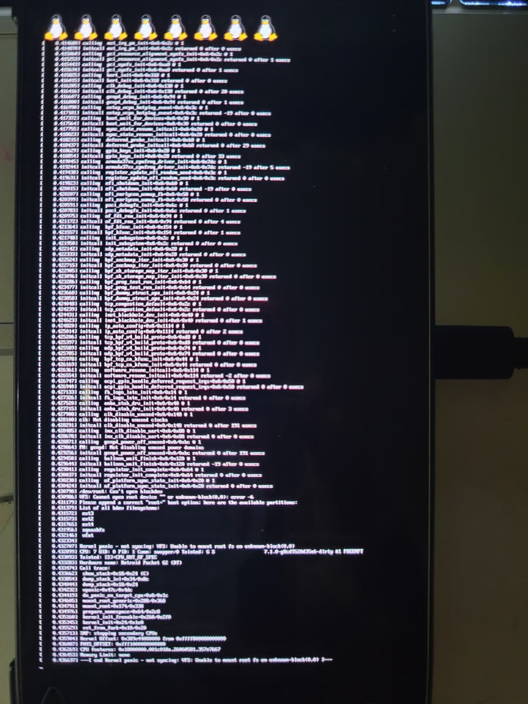

# SD boot, re-investigated: how Armada does it, and the ROCKNIX SM8650 ABL — 2026-09-29

Question from the user after Path A closed: Armada runs SteamOS from the SD card
and leaves Android on internal storage. Isn't that done by swapping the
bootloader, with a menu to pick SD or internal?

Yes. That is exactly the mechanism, and re-reading it with the actual binaries in
hand changes our Path B assessment: **we may not need to build a Cliffs ABL at
all.**

## How Armada (and ROCKNIX, Batocera, Knulli, holodor…) boot from SD

Read from `armada-os/armada` (`abl/`) and `ROCKNIX/abl` (release v1.1.9):

1. The SD image carries `rocknix_abl/<SoC>/abl_signed-<SoC>.elf` plus three
   scripts: `backup_abl.sh`, `flash_abl.sh`, `restore_backup_abl.sh`.
2. From Android, as root, `backup_abl.sh` dumps `abl_a`/`abl_b`, then
   `flash_abl.sh` does `dd` of the ROCKNIX ABL into **`abl_a` and `abl_b`**.
   Nothing else on internal storage is written. Android (boot, vendor_boot,
   super, userdata) stays as it is.
3. Reboot holding **VOL-** → the ROCKNIX-ABL menu (VOL-/+ to move, POWER to
   select): set the device model, set the boot mode (Linux / Android), Start.
4. From then on the ABL boots Linux from SD (or internal, or USB) by default, and
   Android when chosen or when no Linux is present.

So the "choose SD or internal" behaviour is the replaced ABL. The factory ABL
never looks at the SD card, which is what our three Path A attempts showed.

### What the ROCKNIX ABL loads from the SD card
Strings from the decompressed LinuxLoader (`abl_signed-SM8650.elf`, LZMA FV at
0x2078):
- It scans FAT partitions for `\KERNEL`, `\boot.img`, `\kernel.img`,
  `\boot\Image` (also `cmdline.txt`, `cmdline-append.txt`).
- The payload is an Android boot image. pocknix/holodor `qcom-abl` builds it as
  `mkbootimg --header_version 0` of `gzip(Image)` with the DTBs appended, plus
  an empty cpio (`scripts/build-kernel.sh: assemble_bootimg`).
- It lists the `model` property of every appended DTB in a "Select your device
  model" menu (`ParseModelsFromDtb`, `ModelImageCb`). Linux will not boot until
  a model is set ("DEVICE MODEL NOT SET"). Our DTB has
  `model = "Retroid Pocket G2"`.
- It keeps the full Android path: boot_a/b, init_boot, vendor_boot, dtbo, AVB.
  It also has an "UNINSTALL CFW" option.
- The SD card layout is the one holodor already writes for `qcom-abl`:
  - GPT p1 FAT32, named `system`, holding `KERNEL`.
  - GPT p2 root.

## The key finding: the ABL builds are almost SoC-agnostic

ROCKNIX ships **one ABL per SoC family** (`abl_signed-SM4450/SM6115/SM8250/
SM8550/SM8650/SM8750.elf`), not per device. We decompressed each and diffed the
strings.

**SM8550 vs SM8650:** the only functional difference is a display-power
ExitBootServices callback and `androidboot.client_id`. Everything else is
identical, including:
- the menus and the SD / USB / FAT logic;
- the Android boot path;
- DTB selection by msm-id.

**SM8750 vs SM8550:** the strings are identical.

The ABL is an EFI application running on top of the device's own XBL/UEFI. All
hardware access goes through UEFI protocols that the device's firmware provides:
ChipInfo, PlatformInfo, display, block IO and USB.

This is why one SM8650 build serves two different vendors today: the AYANEO
Pocket S2 and the KONKR Pocket FIT (G3 Gen 3). The G3 Gen 3 is another
Snapdragon G-series gaming chip on the pineapple platform.

**The G2 is a pineapple-platform device.** The dump says
`ro.board.platform = pineapple` (`dumps/g2/g2-consolidated-hardware-*.txt`), and
Cliffs/SM8635 is the pineapple family's cut-down sibling. The natural candidate
is therefore the **existing `abl_signed-SM8650.elf`**, not a new build.

Container format of every ROCKNIX ABL:
- ELF32/ARM, entry and LOAD at `0x9fa00000`, 244 KiB.
- MBN hash-segment header **v7** (SM8250 is v6).
- Signed with **qtestsign "NOT SECURE"** test keys. That is fine here: the G2
  reports `secure:no`, and we have been running the unsigned-loader chain in
  EDL already.
- 258,048 bytes, which fits the G2's 1 MiB `abl` partition.

## What is still unknown, and how to settle each without risk

| Unknown | How it gets settled | Risk |
|---|---|---|
| Does the factory G2 ABL use the same load address (0x9fa00000) and MBN v7? | `scripts/check-abl-compat.py <factory abl_b.bin> abl_signed-SM8650.elf` on the PC, against the 2026-09-28 factory backup | none (reads files) |
| Does XBL accept and start the ROCKNIX ABL? | Flash `abl_b` only, via EDL. The ROCKNIX menu appears when holding VOL- | recoverable (EDL restore of `abl_b`) |
| Does Android still boot through it? | Choose Android in the menu | same |
| Does it boot our kernel from SD? | Card with `KERNEL` = header-v0 boot image with `cliffs-g2.dtb` appended | same |

Recovery is the same EDL write that restored the device on 2026-09-20, applied
to one 1 MiB partition:
```
python edl.py w abl_b <factory-backup>\lunN\abl_b.bin --loader=xbl_s_devprg_ns.melf --memory=UFS
```
Only the active slot's `abl_b` is written, never `abl_a`, and there is no slot
switching. Never run `fastboot set_active`. Armada writes both slots from Android
as root; we have no root, and EDL does the same job for one partition.

## Consequences for the plan

- **Path B changes from "build a Cliffs ABL from private source" to "try the
  public SM8650 ROCKNIX ABL".** This is the Armada route itself. If it runs, the
  whole ecosystem's boot contract applies to the G2 unchanged:
  - holodor's `qcom-abl` mode;
  - an SD card with `KERNEL` in a FAT partition named `system`;
  - Android kept intact.
- **Path C** (overwrite `boot_b`) becomes second choice. It would be a one-off
  test that leaves Android unbootable until restored. Path B, if it works, is the
  permanent dual-boot.
- The kernel side is unchanged. The profile moves from `BOOTLOADER=arm-efi`
  (dead) to `qcom-abl`. Only the packaging step differs: `assemble_bootimg`
  instead of the raw Image.

## Result 2026-09-29: compat check passed

The user ran `check-abl-compat.py` on the factory backup
(`backup_factory_20260928_001726\lun4\abl_b.bin`):
- factory ABL: ELF32 ARM, entry and LOAD `0x9fa00000..0x9fa39000` (228 KiB), MBN v7, 241,464 B;
- ROCKNIX SM8650: ELF32 ARM, entry and LOAD `0x9fa00000..0x9fa3d000` (244 KiB), MBN v7, 258,048 B;
- every check OK: *"all checks match the factory ABL"*.

One residual: the ROCKNIX image reaches 16 KiB further (to `0x9fa3d000`). The
same SM8650 build loads on two vendors' pineapple devices, so XBL's ABL window
is very likely at least that large. If it were not, the ABL would not start,
which is recoverable by the EDL restore below.

## Test 3 — ROCKNIX-ABL on `abl_b` (writes one 1 MiB partition)

Artifacts:
- `release/tier0-qcomabl/g2-qcomabl-sd.img.xz`, built by
  `scripts/build-g2-qcomabl-sd-image.sh`;
- `abl_signed-SM8650.elf` from ROCKNIX/abl v1.1.9.

1. Write `g2-qcomabl-sd.img.xz` to a spare microSD with Etcher, as in Test 1.
   Leave it **out** of the G2 for now.
2. Enter EDL (9008), then:
   ```
   python edl.py w abl_b abl_signed-SM8650.elf --loader=xbl_s_devprg_ns.melf --memory=UFS
   python edl.py reset --loader=xbl_s_devprg_ns.melf
   ```
   Only `abl_b`. Never touch `abl_a`, never switch slots, never run
   `fastboot set_active`.
3. **Check A (normal power-on):** does Android boot as usual? The factory Linux
   mode is off until chosen in the menu.
4. **Check B:** power off, then power on holding **VOL-**. Does the ROCKNIX-ABL
   menu appear? Navigate with VOL-/+ and select with POWER. Photograph it.
5. **Check C:** insert the card, open the menu again, and:
   - set the device model: "Retroid Pocket G2" should be listed, read from our
     DTB;
   - set the boot mode to Linux (SD);
   - select Start.

   Success is the kernel log on screen, ending at
   `VFS: Unable to mount root fs`, because there is no rootfs yet.
6. To use Android again: VOL- menu, set the boot mode to Android.

Results table:

| Seen | Meaning |
|---|---|
| Black screen or no boot at all | XBL did not start this ABL → restore below |
| Android boots, and the VOL- menu appears | **ABL works on the G2**: dual-boot mechanism in place |
| The menu shows no model / "DEVICE MODEL NOT SET" | payload/DTB parsing issue; photograph it |
| Kernel log on screen | **First kernel output. Tier 0 done** |
| Logo hang after Start, no log | kernel started without console, or early hang; photograph it |

**Restore** (EDL; the same method as the 2026-09-20 recovery):
```
python edl.py w abl_b backup_factory_20260928_001726\lun4\abl_b.bin --loader=xbl_s_devprg_ns.melf --memory=UFS
python edl.py reset --loader=xbl_s_devprg_ns.melf
```

## Result 2026-09-29: ROCKNIX-ABL runs on the G2

`abl_signed-SM8650.elf` (v1.1.9) was EDL-written to `abl_b` (LUN 4, sector
448058, 63 sectors). On reset the device showed ROCKNIX-ABL's own error screen,
with no SD card inserted:

> **ERROR** — Error booting Linux. Switch ABL mode to Verbose for more
> information. Press any key to reboot!

- **XBL accepted and started the ROCKNIX ABL.** The load window is large enough
  and the test signature is accepted.
- **ABL display output works** through the G2's UEFI display protocol.
- The factory default boot mode is **Linux**, not Android as assumed above.
  With no card present, the Linux boot fails, which is the expected message.

So the Armada dual-boot mechanism works on the G2's firmware.

**VOL- menu: works.** The header reads "Recovery mode".
- ABL Settings:
  - Boot mode: Linux
  - ABL mode: Silent
  - Alternative volume up: Android
  - Boot source: Auto
  - Offmode charging: On
  - Version: v1.1.9
- System Stats, all read correctly from the G2's firmware:
  - SoC: Snapdragon G2 Gen 2
  - RAM: 8 GB
  - Storage: 128 GB
  - SD card: Not Inserted
  - Display: 1920 x 1080

**Android through ROCKNIX-ABL: works.** With Boot mode set to Android, the stock
Android boots. The dual-boot is in place; stock ABL is no longer needed day to
day. The `abl_b` backup stays as the restore path.

Remaining check: Linux from the SD card (`release/tier0-qcomabl/`), with the model
set.

## Result 2026-09-29: Linux boot, rev 1 → black screen; cause found

With the card inserted, the menu set up (model selected, Linux, Verbose) and
Start pressed, the ABL's verbose log scrolled, then the screen went black and
stayed black.

The cause is in the ABL, not the kernel. LinuxLoader's DT fixup (strings, in
order):
- It looks up `/reserved-memory/splash_region`, then
  `/reserved-memory/cont_splash_region`.
- If neither exists: *"Splash region not found in device tree, powering down the
  display and controller"*.
- If one exists: it rewrites `reg = <… …>` with the live FB address and size,
  then logs *"Display keep-alive: splash node present"*.

Our node was named `splash@e3940000`. libfdt `fdt_path_offset` returns
`FDT_ERR_NOTFOUND` for it (verified with `fdtget`), so the ABL shut the panel
down before jumping. `simple-framebuffer` then scans out to a dark panel.

**Fix (rev 2):** the node is renamed `splash_region@e3940000`, matching the
vendor tree's name, in both `dts/cliffs-g2.dts` and
`kernel/sm8635/dts/qcom/cliffs-g2.dts`. The lookup now resolves. The
`release/tier0-qcomabl/` artifacts are rebuilt from the same Image, and the DTB
differs only in that node name. The source build (`scripts/build-g2-dtb-compile-candidate.sh`) produces a byte-identical `cliffs-g2.dtb` (sha256 `35b9b386…`).

## Result 2026-09-29: rev 2 → ABL log to the end, then black

What the ABL printed with Verbose mode:
- "Total DDR Size: 0x1F112E000", then about 45 lines of *"Failed to get
  Symbols node: /__symbols__ error: -1"*. These come from the partial-goods
  label lookups (the gpucc/camcc/remoteproc label list), which our DTB has no
  `__symbols__` for, so they are harmless.
- "PartialGoods Value: 0x0" and "Update Device Tree total time: 91 ms".
- "Shutting Down UEFI Boot Services: 4539 ms", followed by more symbol lines.

The screen then went **black**. The ABL got through its whole path and jumped.
A kernel that hung early would have left this log frozen on screen. Black means
something the kernel ran cut the display path. The suspects, all present in the
rev 2 DT:
- **apps_smmu** (arm-smmu reset or stream-mapping handoff on the MDSS fetch
  path);
- **interconnect** sync_state dropping the boot bandwidth votes on the MMSS/GEM
  NoCs;
- **gcc**: clk_disable_unused on `GCC_DISP_*`, and GDSCs.

**Diagnostic build** (`release/tier0-qcomabl/diag/KERNEL`, source
`dts/cliffs-g2-diag.dts`):
- It is rev 2 with apps_smmu, all 14 interconnect providers, gcc and sdhc_2
  disabled.
- It is compiled with `-@`, so it has `__symbols__` and the ABL's symbol errors
  go away.
- Its cmdline adds `clk_ignore_unused pd_ignore_unused`.
- Same Image; the embedded config shows FB_SIMPLE=y and FRAMEBUFFER_CONSOLE=y.

How to read the result:
- **Kernel log shows:** one of the three groups is the culprit. Bisect by
  re-enabling them one at a time.
- **Still black:** the display is cut before any kernel driver runs. Look at
  the ABL's ExitBootServices display callback, which exists in the SM8650 build
  only, or at the FB address and format.

## Result 2026-09-29: diagnostic KERNEL → still black

With the display-safe DTB:
- The ABL log is clean. `__symbols__` is present, so it now only prints
  *"Not a Valid Label: cam_*"* for partial-goods labels that we do not have.
- The screen still goes black after the jump.

**SMMU, interconnect, gcc and clk/pd cleanup are ruled out.**

Checked and ruled out, from the desk:
- **Reserved memory:** every vendor `no-map` region is covered by ours. The only
  fixed regions we lack are `qdss_apps` and the `trust_ui_vm`/`oem_vm`
  shared-dma-pools, and none of those is no-map.
- **FB format:** RP5 in Armada uses the same simple-framebuffer shape (1080x1920,
  a8r8g8b8, stride 4320) on a Qualcomm ABL splash. Ours matches.
- **Config:** the kernel's embedded config has FB_SIMPLE and FRAMEBUFFER_CONSOLE
  enabled.

Leading explanation: the kernel dies before fbcon prints, and the SoC then
resets. A silent hang would have left the ABL log frozen. A reset (for example
the watchdog, or an XPU fault) blanks the screen, and on Qualcomm it lands in
download (9008) mode. The KONKR SM8750 bring-up in Armada saw exactly
"boot → EDL".

Next data to collect (no writes):
- Time from the jump to black.
- Whether the device enumerates as 9008 afterwards. If it is in Sahara
  memory-dump mode, edl.py can capture RAM and the kernel log can be found in
  it.
- A video of the whole Verbose log, to read the ABL's *"Splash memory region
  before/after updating: reg = <…>"* lines (the live FB address).

## Result 2026-09-29: video + device state → crash dump mode (900E)

From the video (120 fps, read frame by frame):
- The ABL loaded `\KERNEL` (0xF81000 B) and ran LoadImageAndAuth
  ("boot state orange").
- It reported *"FatCacheFix: SoC chipid 0x2BC"*, which matches our msm-id.
- *"Decompressing kernel image total time: 314 ms"*.
- *"[DTB MATCH FOUND]: Retroid Pocket G2"*, then *"Linux boot, disabling Android
  DTBO overlays!"*.
- The cmdline is ours, and the "Final RAM Partitions" list begins at
  0x80000000.
- The ABL then shut down boot services.

After that, the ABL log stayed on screen **unchanged for about 8 s**, then the
screen went black. The kernel never drew on the scanned-out buffer.

After the black screen, Windows lists **Qualcomm HS-USB Diagnostics 900E**:
Sahara memory-dump mode. The SoC went through an abnormal reset (a kernel crash,
or a watchdog bite at about 8 to 10 s), and DRAM is preserved and readable.

Next: capture it with `edl.py memorydump` and run
`scripts/g2-ramdump-scan.py`. That gives the kernel log (search
"Linux version 7.1") and the contents of 0xe3940000 as a BMP. The BMP shows
whether fbcon drew into the buffer we point simple-framebuffer at.

## Result 2026-10-01: RAM dump → the kernel hangs at the TLMM

`edl.py memorydump` from 900E captured all 8 GB:
- DDRCS0_0, at 0x80000000, 2 GB;
- DDRCS1_0..2, at 0x880000000.

`g2-ramdump-scan.py` found the printk text ring in DDRCS0_0 at file offset
0x2b305150.

What the diag-boot log shows:
- The kernel boots fine through early init:
  - "Machine model: Retroid Pocket G2", the reserved-memory map as designed,
    7.3 GB available;
  - PSCI 1.1 with OSI;
  - GICv3 with 988 SPIs and redistributors for CPU0..7;
  - the arch timer at 19.2 MHz;
  - all 8 CPUs up at EL1.
- Harmless notes: "Kernel image misaligned at boot" (the ABL places the kernel
  off its 2 MiB alignment), "Unexpected variation in SYS_ID_AA64MMFR1_EL1"
  between the big and little cores, "efi: UEFI not found".
- The **last** message is at 0.017815 s: *"/soc@0/interrupt-controller@17100000:
  Fixed dependency cycle(s) …"*, printed during of_platform_populate. Nothing
  follows. The watchdog bit about 8 s later, so the SoC went to 900E and the
  screen went black. fbcon never ran, which is why nothing was ever drawn.

**Cause:** the next device to probe is the TLMM. gpiolib reads every valid
line's direction when the gpiochip registers. The vendor tree has
`qcom,gpios-reserved = <56 57 58 59 60>` on `pinctrl@f000000`: secure-world
GPIOs that the APPS side may not touch. Our tlmm node had no reserved ranges,
so the kernel touched GPIO 56-60 and hung.

**Fix:** `gpio-reserved-ranges = <56 5>;` on tlmm in `cliffs.dtsi` (both
copies). The new builds are:
- `release/tier0-qcomabl/diag2/KERNEL`: display-safe DT plus the fix. Try it
  first.
- `release/tier0-qcomabl/rev3/KERNEL`: the full DT plus the fix.

Both cmdlines add `initcall_debug log_buf_len=4M`, so the next RAM dump, if one
is needed, names the last initcall.

### Same dump: the framebuffer and the reset registers

**The framebuffer is right.**
`g2-ramdump-scan.py --fb memory\DDRCS0_0.BIN 0x80000000` renders 0xe3940000
as 1080x1920 a8r8g8b8, stride 4320, and shows a clean **"QUALCOMM CrashDump
Mode"** screen. XBL's ramdump UI wrote it after the reset:
- "RAMDUMP BUILD @ 17:37:42 on Dec 10 2025"
- "PM: PM_DT_PARSING_ERR: sw-config"
- "UFS Spec 3.10, SKhynix HN8T05DEHKX073, Boot LUN 2, 128 GB"

So the scanned-out buffer is at exactly the address and in exactly the format
our simple-framebuffer declares. Once the kernel gets past the TLMM, fbcon
draws where the panel looks. The panel was off during dump mode, which is why
the screen looked black.

Reset registers:
- `RST_STAT` = 0x3;
- `FSM_STS` = 0x00021101;
- `PMIC_PON` = 00 02 40 02.

The XBL build is `BOOT.MXF.2.1-02003-LANAI-1` (load.cmm). These fit a
watchdog-initiated warm reset into dump mode, and agree with the kernel log
stopping at 0.018 s.

## Result 2026-10-01: TIER 0 DONE: first Linux kernel output on the G2

`release/tier0-qcomabl/diag2/KERNEL` boots and prints to the panel:



- Eight Tux logos, one per CPU, and the full `initcall_debug` log on the panel
  through simple-framebuffer and fbcon.
- Late initcalls run cleanly: `clk: Not disabling unused clocks`,
  `PM: genpd: Not disabling unused power domains`, `regulator_init_complete`,
  `of_platform_sync_state_init`.
- At 0.4307 s: `/dev/root: Can't open blockdev`, then
  `VFS: Cannot open root device "" or unknown-block(0,0): error -6`, and
  `Kernel panic - not syncing: VFS: Unable to mount root fs on unknown-block(0,0)`.
  This is the expected end: there is no root= and no storage driver in the
  display-safe DT. The panic comes from `Hardware name: Retroid Pocket G2 (DT)`
  on kernel 7.1.0.

The boot chain that works:
1. stock XBL;
2. **ROCKNIX-ABL SM8650 build, in `abl_b` only**;
3. SD FAT `KERNEL`, a header-v0 boot image of gzip(Image) with our DTB
   appended;
4. our SM8635 kernel.

Android remains bootable from the same ABL.

The fixes that got here:
- the splash node name `splash_region`, so the ABL keeps the panel on;
- `gpio-reserved-ranges = <56 5>`, so the kernel stops hanging on secure TLMM
  pins.

## Result 2026-10-01: rev3 (full DT) boots, display survives

With every ported driver enabled, the boot runs to the same VFS panic, and the
panel stays lit the whole way. From the on-screen initcall_debug log:
- `qnoc-cliffs 16c0000.interconnect: Registered CLIFFS ICC` and the same for
  1600000: **our ported interconnect driver works on hardware**. gcc, pinctrl
  and the rpmh regulators probe without errors.
- `probe of 15000000.iommu returned -517`: apps_smmu defers. arm-smmu-qcom
  waits for `qcom_scm_is_available()`, and there was no firmware/scm node.
- `cliffs-pinctrl f000000.pinctrl: does not have pin group sdc2_clk` (and
  `sdc2_cmd`, `sdc2_data`), "could not map group config": SM8635 has no
  dedicated SDC2 pads. The vendor `sdc2_on` uses clk gpio62, cmd gpio51 and
  data gpio38/39/48/49, with functions sdc2_clk, sdc2_cmd and sdc2_data.
- `probe of 8804000.mmc returned -517`: sdhc_2 defers behind both of the
  above.

**Rev 4** (`release/tier0-qcomabl/rev4/`):
- adds `firmware { scm { compatible = "qcom,scm-sm8635", "qcom,scm"; } }`;
- moves the sdc2 pin states onto those GPIOs with the vendor drive and bias;
- adds `root=PARTUUID=…0002 rootfstype=ext4 rootwait` to the cmdline.

Success looks like `VFS: Mounted root (ext4 filesystem)` followed by a "No
working init found" panic, which means the SD path works end to end.

## Next steps
1. ~~Compat check~~: passed, see above.
2. ~~Build the `qcom-abl` SD card, with KERNEL as a header-v0
   boot image of our 7.1.2 kernel and `cliffs-g2.dtb`.~~ Done:
   `release/tier0-qcomabl/`.
3. ~~EDL-write `abl_b` only~~ (done: ROCKNIX menu, Android and SD Linux all
   work). Next: rev3, the full DT with gcc, interconnect, SMMU and SDHC, then a
   root filesystem on the card's p2. Original step:
   - Boot normally: Android should still start.
   - Reboot holding VOL-: the ROCKNIX menu should appear. Set the model to
     "Retroid Pocket G2" and boot Linux from the SD card.

## Sources
- `ROCKNIX/abl` README and `update.sh`; release `v1.1.9`
  (`rocknix-abl-v1.1.9.tar.gz`, SoC ELFs listed above).
- `armada-os/armada`: `abl/README` (install steps, SoC→device table),
  `abl/flash_abl.sh.template`, `abl/backup_abl.sh.template`, `abl/release.env`
  (ABL 1.1.8).
- pocknix-os `devices/sm8550/profile.conf` (qcom-abl SD contract),
  `scripts/build-kernel.sh` (`assemble_bootimg`).
- G2 facts: `dumps/g2/g2-consolidated-hardware-20260914-222623.txt`
  (`ro.board.platform=pineapple`), `g2-getvar-analysis-20260915.md` (abl 1 MiB,
  secure:no), `g2-EDL-recovery-runbook.md`.
